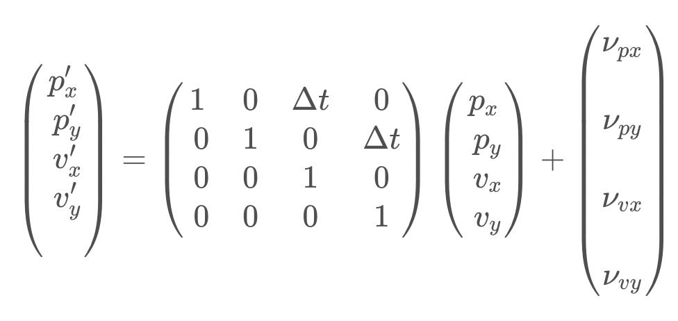

# Extended Kalman Filter

## Overview

In this project real-time implementation of extented kaman filter is simulated on the simulation platform that is given by Udacity. Pipeline is written in C++. 

The main purpose of this project is to estimate position and velocity of a bicycle moving around a ego vehicle, and the virtual sensors are Lidar and Radar. The sensors are assumed to be mounted at the center of a vehicle.

Lidar measurements are red circles, ladar measurements are blue circles with an arrow pointing in the direction of the observed angle, and estimation markers are green triangles.

Note that blue car indicates our target object whose position and velocity are to be estimated and the Sensor coordinate `{X, Y}` is attatched to our ego vehicle.

## Problem Formulation

### State vector 

States to be estimated are the position and velocity of a target object in both x and y direction. Namely,

### State prediction

The position can be represented by integral of velocity. It can be written in a discrete time as `p(k+1) = p(k)+dt*v(k)`. Implementing this relationship, the prediction model can be derived as follow:

The above equation is `xdot =Fx + noise`. The model assumes veloicty is constant between time intervals, but in reality we know that an object's velocity can change due to acceleration. The model includes this uncertainty via the process noise. Derivation of process noise and process covariance matrix `Q` are as follow:

### Prediction stage

---

---

## Measurement Update

When updating measurements of sensors, the models of lidar and radar are different. Specifically, lidar model is linear, but the radar model imposes nonlinearity. This is why we use EKF rather than use classical KF.

### Lidar

Lidar sensor directely measures the point cloud of objects respect to the ego vehicle. This gives us a linear relationship, which is simply represented as follow:

### Radar

Radar sensor measures coordinates of range, bearing and range rate. This measurement has nonliear relationship with the state vector. This relationship can be represented as follow:

=&space;\begin{bmatrix}&space;\rho\\&space;\phi\\&space;\dot{\rho}&space;\end{bmatrix}=&space;\begin{bmatrix}&space;\sqrt{p_x^2&plus;p_y^2}\\&space;\text{atan2}(p_y,p_x)\\&space;{p_xv_x&plus;p_xv_y}\over{\sqrt{p_x^2&plus;p_y^2}}&space;\end{bmatrix})

Hence for radar `y = z - Hx` becomes `y = z - h(x)`. Extented Kalman filter is a just extended version of Kalman filter for handling this kind of nonlinear relationship by calculating Jacobian matrix at every estimation step.

* Jacobian matrix of `h(x)`

  After calculating all the partial derivatives, our resulted Jacobian, `Hj` is:

  

### Correction stage

---

---

## Pipeline

